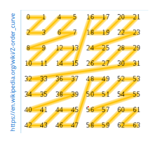
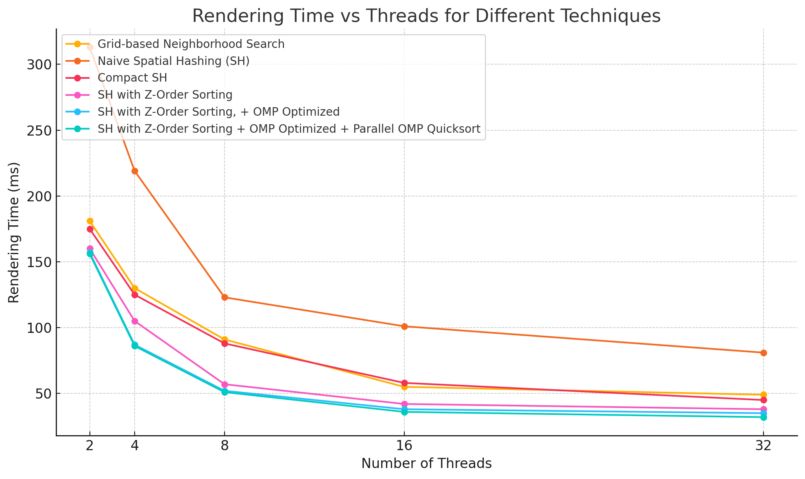
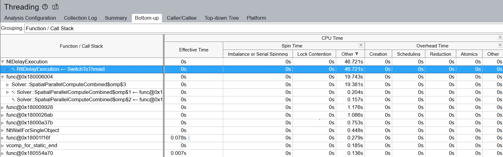
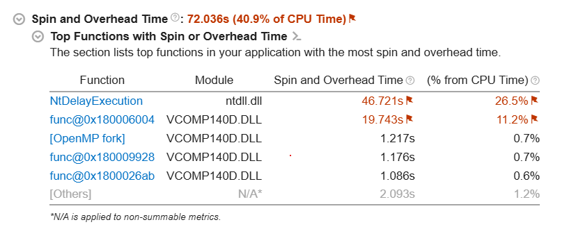
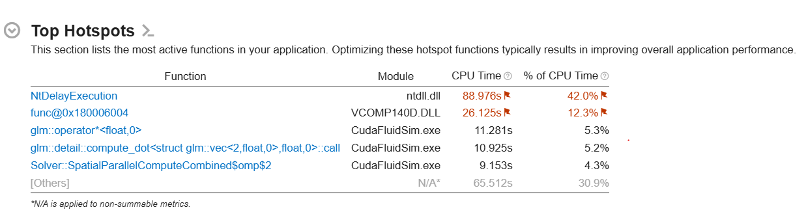
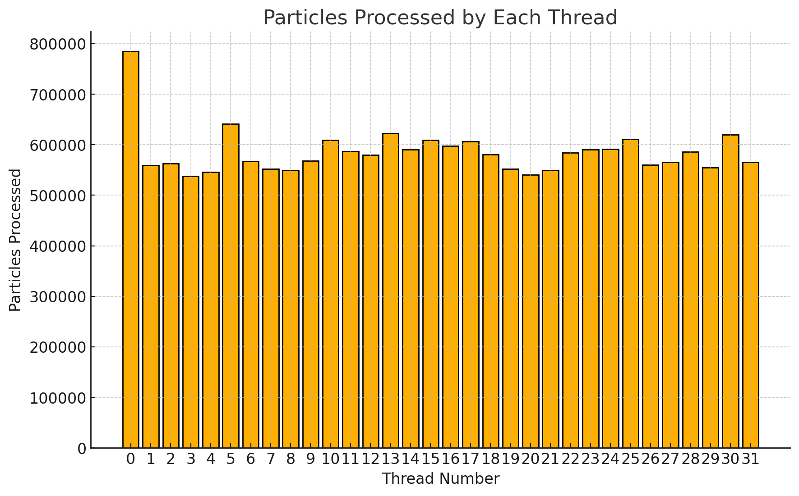

# Particle-Based Fluid Simulation
Contributors: Jingxuan Chen, Hank Xu

## Problem Definition
We are going to implement a particle based 2D fluid solver based on smoothed particle hydrodynamics  (SPH).

### Background
SPH represents fluid as a set of particles that carry properties like mass, velocity, and pressure.
Fluid behavior such as motion, collision, and viscosity are simulated by considering contributions from neighbouring particles.
More specifically, at each timestep each particle would compute its local density and pressure based on 
the position of surrounding particles, and using those two values compute the force acting on the 
particle, which can be used to derive acceleration and update the particle position.
A smoothing kernel radius $H$ is used to determine which particles contribute to interactions 
(specifically, particles outside the radius are ignored).

#### Data Structures
The main data structures used in our SPH are:

- **Particles**: Each particle contains properties such as position ($\mathbf{p}_i$), 
velocity ($\mathbf{v}_i$), mass ($m_i$), density ($\rho_i$), pressure ($p_i$), and some additional fields.
- **Particles List**: A list of all the particles currently simulating. This is sorted *per frame* 
according to their spatial coordinates to exploit more locality.
- **Spatial Hashing table**: Each particle is hashed into an array of fixed size, 
determined by their $(x,y)$ coordinate into a square cell of $H$ in sides.

#### Key operations
The main operations in SPH involve computing interactions between particles.
A naive SPH implementation involves a forward Euler integrator with two main kernel computations:
- **Compute Density Pressure**: Updates the density and pressure of each particle in the SPH simulation.
- **Compute Forces**: Updates the forces acting on each particle, including pressure, viscosity, and gravitational forces.
- **Forward Euler Integration**: For each particle, we will perform naive euler integration:
$$ \mathbf{v}_i^{new} = \mathbf{v}_i + \frac{dt \cdot \mathbf{F}_i}{\rho_i} $$
$$ \mathbf{p}_i^{new} = \mathbf{p}_i + dt \cdot \mathbf{v}_i $$
Refer to [[1]](#1) for more algorithmic details on how this works.

#### Computationally Expensive Parts
The most computationally expensive parts of the SPH algorithm are:
- **Pairwise Interaction Calculations**: For each particle, interactions with nearby particles are computed. 
This is an $O(n^2)$ complexity for naive implementations.
- **Synchronization Overhead**: The main bottleneck is not computation, but synchronization. 
We have to be careful not to make block sizes too small otherwise we introduce lots of overhead.
- **Sorting**: Sorting particles accounted for approximately 10\% of the total computation. 
So it is anything but trivial if done every frame.

#### Parallelization Breakdown
The SPH algorithm is highly **data-parallel**. These are some ways we have experimented with parallelism:
- **Neighbor Search**: Each particle searches for nearby particles within a given radius. Spatial partitioning methods reduce the number of comparisons, improving efficiency. There is also a lot of temporal locality to be utilized here.
- **Force Computation**: The force calculations for each particle can be performed in parallel since the force computation for each particle is independent.
- **Sorting**: A big question is, can we sort in parallel? The answer is yes. We implemented a parallel merge sort in OpenMP which performs better than naive or C++ `std::unseq::parallel` execution methods.

**Dependencies**: The only dependency is that the Computation for density and pressure must precede the computation for forces. (We cannot compute forces without the density and pressure of all the particles around it (in particular, all the particles in the 9 cells around that particle).

**Workload**: This workload is embarrassingly parallel. The force calculations and particle updates are independent for each particle, which allows fine-grained parallelism on both CPU (via OpenMP) and GPU (via CUDA).

**Locality**: A naive application will perform atrocious in locality. We used many techniques to utilize more locality, both spatial and temporal in our implementation. We tried to incorporate SIMD but it was not successful. However, this application will definitely benefit from SIMD methods.
<!-- 
### The Challenge
Similar to the galaxy evolution problem discussed in class, in particle based fluid simulation the amount of work per particle and communication pattern is non-uniform since it depends on the local density of particles, the particles move so costs and communication patterns change over time, and there is also a lot of locality to exploit since particles close to each other in space require similar data to calculate forces. Thus the goal would be the same, we want equal work per processor and assignment should preserve locality.

However, a key difference is that particle positions in fluid simulation change much faster than those in galaxy evolution, so a similar semi-static assignment approach would be unlikely to yield the same benefits for fluid simulation as more frequent recomputation is needed to maintain the same level of locality. Though, one benefit that we have is that dependencies in fluid simulation are much simpler than dependencies in the galaxy evolution problem (In fluid simulation, particles outside a certain radius are ignored, whereas in galaxy evolution no particles can be ignored and faraway particles have to be averaged instead) so perhaps the reduced compute balances out the previous downside.

### Resources
We will heavily refer to [this](https://lucasschuermann.com/writing/implementing-sph-in-2d) sequential implementation of a SPH solver provided by Lucas V. Schuermann written in C++.

### Platform Choice
We will be using **glfw** for windowing, **OpenGL** for rendering, and using **OpenMP** and **CUDA** to explore GPU and CPU parallelization.

Since high resolution fluid simulation requires a whole lot of particles, it is tempting to have each particle be its own thread and use CUDA to dispatch a large number of threads to run in parallel. However, this approach might have less locality since we cannot control which particle gets assigned to which processor. With OpenMP on the other hand, we have more control over how to distribute data to processors improving workload balance and locality, but we would be unable to leverage the power of a GPU. Since both have its pros and cons we would be interested in trying both approaches.

## Progress
We have set up a basic renderer for our fluid simulation, imported the sequential implementation, and made lots of progress on the CPU parallelization side.

We started with a naive parallelization by simply changing the for loop over particles to a parallel for. Building upon that, we partitioned the simulation space into cells so that each particle only checks particles in its adjacent cells rather than all particles. This reduces computation costs from O(N2) to O(NM). To improve spatial locality, the cells were hashed such that particles in the same cell can be sorted next to each other in the particle list.

GPU implementation wise we have fallen a bit behind due to running into some issues figuring out how to compile CUDA code locally. The naive GPU implementation has been written, but we haven’t gotten a chance to test it just yet. However, we should have recently figured out the compile issues so progress shouldn’t be blocked.

We believe the core deliverables stated in the proposal are all reachable, though we will probably not extend our implementation to 3D. The other stretch goal that we have (the one about exploring optimizations unique to the fluid simulation problem) is kind of already partially fulfilled since partitioning the simulation space into a grid was one of the optimizations.

### Planned Presentation
We will have a demo showcasing an interactive application where one can test out different kinds of parallelism and see the fluid simulation happen in real time. There will be real time graphs showing profiled frame times and static graph showing cache locality or profiled statistics.

### Preliminary Results
**CPU Results** <br>
Particle Count: 40K <br>
Acceleration Method: spatial compact hashing <br>
Video Speedup: 4x <br>
[](https://youtu.be/5p2VmZYt70g)

You can see the renderer starts off fast, but when particles clump together, it gets really slow (somewhere in the middle of the video). This is most likely due to load imbalance. We will tackle this using cost zones and fine grained parallelism. -->

## Approach

Our journey started with a naive implementation based on [[3]](#3) that is sequential and trivially parallelizable:
```c++
// m_Particles : Vector<Particle>(NUM_PARTICLES);
// called each frame
void Simulate() {
    #pragma omp parallel for
    for (int i = 0; i < m_Particles.size(); ++i) {
        for (int j = 0; j < m_Particles.size(); ++j) 
            if (j != i) // accumulate density and pressure for the pair (i,j)
                UpdateDensityPressure(i,j)
    }
            
    #pragma omp parallel for
    for (int i = 0; i < m_Particles.size(); ++i){
        for (int j = 0; j < m_Particles.size(); ++j) 
            if (j != i) // compute viscosity, pressure, and gravity forces for (i,j)
                UpdateForces(i,j)
    }
    
    Integrate(dt); // forward euler integration
}

// A naive particle structure will contain about 40 bytes on the CPU.
struct Particle {
    float2 position;    // 8 bytes
    float2 velocity;    // 8 bytes
    float2 force;       // 8 bytes
    float density;      // 4 bytes
    float pressure;     // 4 bytes
}
```
A keen computer science student will discover that this is an incredibly inefficient algorithm of $O(n^2)$ computation cost. Fortunately, there is a widely used technique called spatial partioning. [[2]](#2) has a pretty good slide deck on this topic, and we implemented all the techniques illustrated on that presentation. 

Spatial partitioning involves efficiently finding neighbors. We had an intuitive insight is to divide the simulation space into $m$ cells. Neighbors, then, must lie within the nearest 8 neighboring cells (or 26 for 3D applications). Sorting particles into grid/finding neighbors will come down to $O(m)$.

This method worked, but it resulted in wasted space and lots of queries into empty memory cells.

We found Spatial Hashing [[2]](#2) to be a better alternative. In particular, we represent the simulation space as a sparse hashmap. We store only populated cells by using a 2D hashfunction $(i,j) \rightarrow [p_1, p_2...]$. A suitable hash function we chose as according to literature is 
```c++
int GetHash(float2 cell)
{
    return ((cell.x * 73856093) ^ (cell.y * 19349663)) % TABLE_SIZE;
}
```
This meant much lower memory requirements. However, we still struggled with spatial locality, as we store the particles in a list (and not a 2D grid), querying nearby cells does not guarentee the particles are next to each other (we are essentially still getting 0 locality this way). In other words, neighboring cells are not close in memory. 

What do we do?

We decided to use compact hashing -- sort cells in secondary structure such that particles in the same cell are next to each other. We additionally used space-filling z-curve to further improve the locality computations.
<figure>
    <p align="center">
    
    <figcaption><p align="center">Figure 1: Useful to sort particles along Z-curve as well</figcaption>
</figure>

```c++
// each particle gets assigned a hash corresponding to a particular cell in the grid
#pragma omp parallel for schedule(static)
for (int i = 0; i < m_Particles.size(); ++i)
    m_Particles[i].hash = SpatialHashTable::GetHashFromParticle(m_Particles[i], CELL_SIZE);

// sort particles by the particle's hash
std::sort(m_Particles.begin(), m_Particles.end(),
    [&](const Particle& i, const Particle& j) {return i.hash < j.hash;});

// m_ParticleHashTable[cell_hash] = starting particle index of that cell
SpatialHashTable::CreateNonAlloc(
    m_Particles.data(), 
    NUM_PARTICLES, 
    m_ParticleHashTable.data());
```

This resulted in much better performance overall.

There is more room for improvement however. We turned our attention to the OpenMP side. Surely... there are somethings we can do to improve over the naive OpenMP implementation...

It turned out to be a tough task. It was obvious that $schedule(dynamic)$ was going to be the way to go due to the highly variable workload, but what could we do other than that?

We tried the following:
#### Instead of looping over particles, we loop over cells
```c++
for (auto& non_empty_cell : cells)
    for (auto& particle : non_empty_cell)
        DoComputationForParticle(particle);
```
The idea was to use even more temporal locality. Since all the particles in that cell continuously access all neighboring particles, we should get more cache hit rate if we process blocks of particles at the same time. 

However, this resulted in minimal improvement, if any. We think that its because OpenMP is already smart enough to figureout how to dynamically schedule the particles, and as well as the fact that our particles are already sorted such that nearby particles in the grid are placed next to each other in memory.

#### For each cell, find all the neighboring particles. Store them in a list for fast future access.
```c++
for (auto& non_empty_cell : cells)
    Vector<Particle*> neighbors = FindNeighbors(non_empty_cell);
        DoComputationForParticle(particle, neighbors);
```
This idea sounded plausible but its actually disastrous. After profiling we found 90\% of the compute time was spent on emplacing elements onto the vector. It was much better to just query over all neighboring cells again.

#### Padding the Particle structure
We wanted to reduce false sharing. Therefore we padded each particle to fit in one cache line:
```c++
struct alignas(64) Particle {  // Match cache line size
	float2 position;    // 8 bytes
	float2 velocity;    // 8 bytes
	float2 velocityHalf; // 8 bytes
	float2 force;       // 8 bytes
	float density;         // 4 bytes
	float pressure;        // 4 bytes
	uint32_t hash;         // 4 bytes
}
```
Although this idea sounded nice, it didn't do a lot to help with performance. We were not able to observe any statistically significant results for signs of improving the frame rendering time.

#### Combining the two parallel for loops and use the omp keyword `nowait`
The observation was that although computing forces depends on density, we didnt have to spawn new threads for them. Whatever scheme we used earlier for dynamic scheduling will apply similarly (because the biggest thing that creates load imbalance is how particles are distributed, which remains the same throughout the two rounds of parallel computations). This small change improved efficiency by 6\%. 

#### omp reduce
We remembered we could use omp reduce to further parallelize the compute into a reduction of a single value (density or forces). We provide pseudocode here:
```c++
#pragma omp for schedule(dynamic, 32) 
for (int i = 0; i < NUM_PARTICLES; ++i) {
    float pDensity = 0;
#pragma omp parallel for reduction(+:pDensity) schedule(static)
    for (auto& cell : cells)
        {...}
}

#pragma omp for schedule(dynamic, 32) nowait
for (int i = 0; i < NUM_PARTICLES; ++i) {
float fpress_x = 0.f, fpress_y = 0.f;
float fvisc_x = 0.f, fvisc_y = 0.f;

#pragma omp parallel for reduction(+:fpress_x,fpress_y,fvisc_x,fvisc_y)\
        schedule(static)
    for (auto& cell : cells)
        {...}
}
```
This change provided noticeable difference (about 8\%)

#### Flattening out the cell iteration for loop
Our first attempt looks like the following:
```c++
#pragma omp parallel for schedule(dynamic)
for (int i = 0; i < m_Particles.size(); ++i)
{
    #pragma omp parallel for
    for (int x = -1; x <= 1; x++)
        for (int y = -1; y <= 1; y++)
            {...} // do something for each cell
}
```
But even if we used the omp keyword $collapse(2)$, it did not do anything at all. We decided to manually flatten this loop out:
```c++
#pragma omp parallel for schedule(dynamic, 32) 
for (int i = 0; i < NUM_PARTICLES; ++i)
{
    float pDensity = 0;
    #pragma omp parallel for reduction(+:pDensity) schedule(static)
    for (int xy = 0; xy < 9; xy++) {
        const int x = xy / 3 - 1;
        const int y = xy % 3 - 1;
        // do something in this cell
    }
}
```
Surprisingly, with this small change, We saw frame rate go from 70ms to only about 40ms at 32 threads and 40k particles. This said to us that we had many idle threads waiting to be assigned work.

#### Parallel Sorting
A naive `std::execution::unseq` turned out to be very unstable. We think this is because omp is not happy about the std library's implementation and the two are competing for resources. 

We implemented our own version of sorting. At this time, sorting was taking about 5ms (about $1/8$ of the total computation). We thought we could do better than this. Here is our implementation
```c++
static const int SERIAL_THRESHOLD = 1024;

template<typename T, typename Compare>
void quicksort_omp(T* data, int left, int right, Compare comp) {
    if (left >= right) return;

    int size = right - left + 1;
    if (size < SERIAL_THRESHOLD) {
        std::sort(data + left, data + right + 1, comp);
        return;
    }

    // pick pivot
    T pivot = data[left + size/2];
    int i = left, j = right;
    while (i <= j) {
        while (comp(data[i], pivot)) ++i;
        while (comp(pivot, data[j])) --j;
        if (i <= j) {
            std::swap(data[i], data[j]);
            ++i; --j;
        }
    }

    #pragma omp parallel sections
    {
        #pragma omp section
        quicksort_omp(data, left, j, comp);
        #pragma omp section
        quicksort_omp(data, i, right, comp);
    }
}

void Simulate() {
    ...
    #pragma omp parallel
    #pragma omp single nowait
    quicksort_omp(m_Particles.data(), 0, int(m_Particles.size()) - 1, cmp);
    ...
}
```
This reduced frame time by 3ms (about 10\% improvement).

The GPU approach starts simple as well. We begin by having each key operation (ComputeDensityPressure, ComputeForces, Integrate) be a dispatch kernel, and parallelize across particles. To quickly verify that the code works, we adapted the CPU code's implementation of the key operations and Particle struct for use in the CUDA implementation. This initial implementation ended up being really slow because of the CPU code's reliance on the glm external library for a lot of its vector math. Since glm is a CPU package, it might be that using its operations within CUDA code creates a lot of unnecessary communication between device and host. Thus the next step was to phase out the use of glm by redefining the Particle struct and reworking the code to match. In order to remove any uncertainty about memory alignment, this is the structure we decided to go with:
```c++
struct alignas(32) Particle {
    float4 position_density_pressure; // 16 bytes
    float4 velocity_force;            // 16 bytes
}
```
Since 2 particles fit fully in a cache line, there is no need for additional padding to reduce false sharing.

## Results
We measured performance by simulating $40k$ particles (headless, no renderer or windowing function) over the first $T = 5$ seconds, taking the average simulation time $t_{avg} = t_{total} / T$. The particles were generated randomly in a uniform disk of Radius $W / 2$, where $W$ is the width and height of the simulation space (assume we simulate in a square).

We are benchmarking on an *Intel(R) Core(TM) i7-12700k with 3.60 GHz clockspeed* CPU (this CPU has 8 performance cores designed for hyperthreading) and *NVIDIA GeForce RTX 3070 Ti 8GB* GPU.

We first compare results using **32 threads** (this value was determined as the best performing thread count on our benchmark CPU on our most efficient algorithm). We do this just to get a hollistic understanding of all the techniques we explored in our project (including Naive and GPU acceleration). Then, we will compare different CPU techniques and their speedups in comparison with single threaded implementation (some techniques were omitted such as GPU is not applicable for comparison, and Naive implementations takes too long). We will benchmark speedup based on the slightly optimized *Uniform Grid-based Neighborhood Search* algorithm.

<p align="center">

| **Technique** | **Rendering Time (ms)** |
| ------------- | ---------------------- |
| Naive OMP $O(n^2)$ | 5360 |
| Grid-based Neighborhood Search | 49 |
| Naive Spatial Hashing (SH) | 81 |
| Compact SH | 45 |
| SH with Z-Order Sorting | 38 |
| SH with Z-Order Sorting <br> + OMP Optimized* | 35 |
| SH with Z-Order Sorting <br> + OMP Optimized* <br> + Parallel OMP Quicksort | 32 |
| Naive GPU $O(n^2)$ | 190 |

<p align="center">
Table 1: Rendering time for different techniques

<figure>
    <p align="center">
    
    <figcaption><p align="center">Figure 2: Simulation Acceleration Techniques Comparison</figcaption>
</figure>

<p align="center">

| **Technique/Threadcount** | **32** | **16** | **8** | **4** | **2** |
| ------------------------- | ------ | ------ | ----- | ----- | ----- |
| Grid-based Neighborhood Search | 49 | 55 | 91 | 130 | 181 |
| Naive Spatial Hashing (SH) | 81 | 101 | 123 | 219 | 313 |
| Compact SH | 45 | 58 | 88 | 125 | 175 |
| SH with Z-Order Sorting | 38 | 42  | 57  | 105 | 160 |
| SH with Z-Order Sorting <br> + OMP Optimized* | 35 | 38 | 52 | 87 | 157 |
| SH with Z-Order Sorting <br> + OMP Optimized* <br> + Parallel OMP Quicksort | 32 | 36 | 51 | 86 | 156 |

<p align="center">
Table 2: Rendering times for different techniques at various thread counts.

<figure>
    <p align="center">
    
    <figcaption><p align="center">Figure 3: Comparison between thread counts on the CPU</figcaption>
</figure>

### Different problem sizes
We tested on $40k$ particles as a standard, but problem sizes of $20k$ and $10k$ are also verified to have similar efficiency pattern using our most optimized method (SH with Z-Order Sorting + OMP Optimized + Parallel OMP Quicksort). However, due to our integration methods, anything beyond $40k$ will imediately become numerically unstable and the simulation breaks as a result of that (particles starts to fly everywhere).

### Limitations

Using Intel VTune, we profiled the threading profile of the application:
<figure>
    <p align="center">
    
    <figcaption><p align="center">Figure 4: Execution time distribution</figcaption>
</figure>

The results further showed the application spent 40.9\% time as Spin and Overhead Time. 
<figure>
    <p align="center">
    
    <figcaption><p align="center">Figure 5: Profile spin time</figcaption>
</figure>

Similarly, a profile of top hot spots show the majority of time we are spending on synchronization.
<figure>
    <p align="center">
    
    <figcaption><p align="center">Figure 6: Hotspots</figcaption>
</figure>

The obvious conclusion is the program is synchronization-bound. However, why is that the case? Is it memory use patterns (caches), task scheduling overhead, or load imbalance?

To figure out whats limiting our performance, we profiled each thread by the number of particles they processed (profiled on 32 threads) \ref{fig:workload} shows this. We see pretty even distribution of work, but the main thread taking on seemingly more tasks than the other threads. 

<figure>
    <p align="center">
    
    <figcaption><p align="center">Figure 7: Workload distribution</figcaption>
</figure>

We suspect the reasoning is as follows: there is significant variation in the amount of work per iteration or task (the particles starts off clustered together, which means each particle needs to compute more in each case). Although we already use dynamic scheduling, it will not always distribute the workload perfectly.

We suspect the largest reason why such a high percentage of time is in spinning and waiting is the scheduling overhead. Unfortunately we were not able to profile memory usage on VTune due to unsolved technical issues (virtual driver or something). We think our spatial cache locality (reuse particles in the same cell, which are adjacent in memory), and temporal locality (process particles in chunks, accessing the same neighbors for all particles in the same chunk), as well as reducing false sharing (padding structures) are all well exploited. The synchronization costs here are high because maybe our application is more memory bound (each particle is not trivial -- 64 bytes) than compute bound, and the cost of scheduling $40k$ particles is non-trivial as well.

### Future Improvements

We investigated omp tasks and more fine grained parallelism to address the above issue. However, our machines seems to be unhappy about omp:llvm and when we compile it using that flag, the performance drops by 10x (not joking). However, we believe there is room for more fine grained parallelism which involves calculating cost zones and putting more workers in zones where the estimated amount of work is high. This is one unexplored section in our project.

The other is algorithmic improvements. We believe, in especially clustered situations, we can estimate the effects of many particles in some radius $h_2$ as a single particle by computing a centroid of momentum. This could significantly reduce neighboring search cost at the expense of calculating an additional critical cell radius for each particle every frame ($O(N)$). However, this could reduce neighborhood search by a factor of $m$, where $m$ is the average number of clusters of radius $h_2$.

For the deeper analysis, we profiled the simulation and found the majority of work ($93\%$) is spent in computing forces, density, pressure. Sorting only consists of $6\%$, and computing hashtables is the last 1\%.

## References

<a id="1">[1]</a>
Markus Ihmsen, Jens Orthmann, Barbara Solenthaler, Andreas Kolb, and Matthias
Teschner. Sph fluids in computer graphics. In Sylvain Lefebvre and Michela Spagnuolo,
editors, Eurographics 2014 - State of the Art Reports, pages 21–42. The Eurographics
Association, 2014.

<a id="2">[2]</a>
Matthias Teschner Dan Koschier Jan Bender, Barbara Solenthaler. Smoothed particle
hydrodynamics: Techniques for the physics based simulation of fluids and solids, part i,
n.d. Introduction, Foundations, Neighborhood Search.

<a id="3">[3]</a>
Lucas V. Schuermann. Implementing sph in 2d, Jul 2017.

<!-- ## Goals and Deliverables

### Planned Goals

#### Minimum Goals
- Sequential implementation of simulation using C++ for baseline comparisons
- Per-particle parallelization of simulation using CUDA
- Naive implementation (random static assignment) using OpenMP

#### Remaining Goals
- Barnes-Hut like implementation using OpenMP
- Analytic graphs such as speedup and cache misses for each approach
- Basic renderer to showcase simulation

### Stretch Goals
- Explore commonly used optimization techniques for SPH (e.g. grid system, solver term precomputation) and integrate at least one that’s non trivial to implement into our approaches
- ~~Make simulation 3D~~

## Schedule
| Timeline | Todo |
| -------- | ---- |
| Mar 26 - Mar 30 (Week 0) | Setup basic application framework and renderer.<br>Port sequential code.<br>Setup timing functions. |
| Mar 31 - Apr 6 (Week 1) | Implement naive CPU solver.<br>~~Implement GPU solver.~~ |
| Apr 7 - April 13 (Week 2) | Spatial binning. |
| Apr 14 - Apr 15 (Week 3) (Milestone Report due) | Gather analytic data.<br>Write report. |
| Apr 16 - Apr 20 (Week 3) | Week 3.1: Explore fine grained parallelism with OpenMP tasks and cost zones. (Hank)<br>Week 3.1: GPU solver with naive per particle parallelism (Jingxuan)<br>Week 3.2: Exploit more locality by assigning threads to cells, not particles (Hank)<br>Week 3.2: Integrate spatial binning into GPU solver (Jingxuan) |
| Apr 21 - Apr 27 (Week 4) | Week 4.1: Build UI (ImGui) for testing out different methods of parallelism for demo purposes (Hank)<br>Week 4.1: Explore if there’s ways that give better locality than what’s currently implemented to communicate data between CPU and GPU (Jingxuan)<br>Week 4.2: Project writeup, analytics data, make poster, write report. (Hank + Jingxuan) |
| Apr 28 (Final Report due) | Update analytic data if necessary.<br>Write report.<br>Make poster. | -->